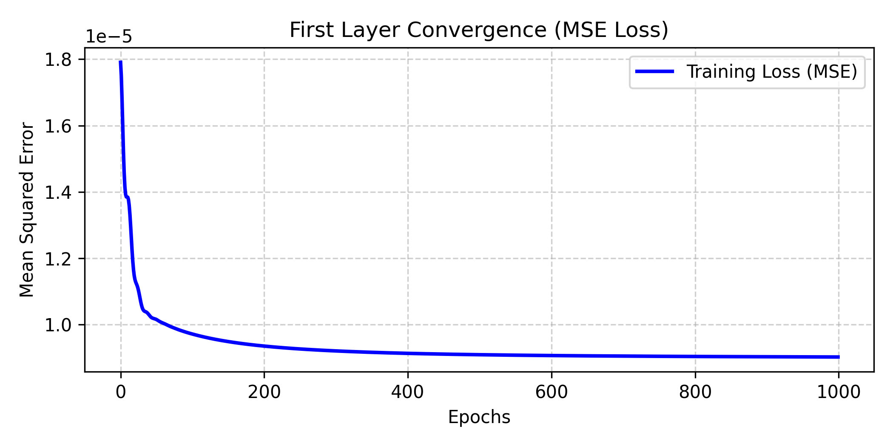
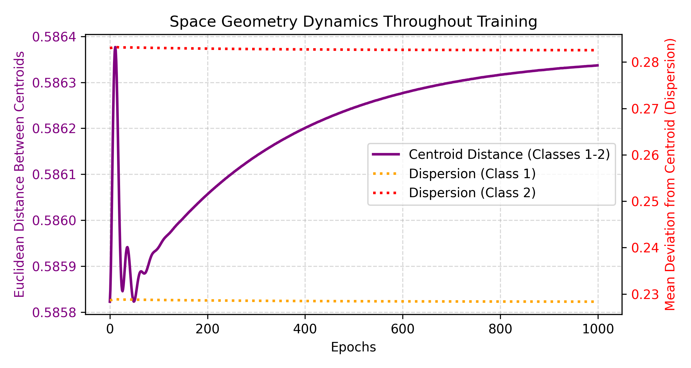

# A Deterministic Multi-Signal Case of Bipropagation Network Initialization

Official Python/PyTorch implementation for the algorithm presented in the *Neurocomputing* journal.

## Abstract
This repository showcases the analytical and deterministic initialization of a single hidden layer using the Bipropagation paradigm, achieving instant 100% linear separability.

## Empirical Convergence Results
Here are the dynamics generated during the target formulation process:

  
  

## How to Run
Simply copy the code inside `bipropagation_demo.py` and run it in Google Colab or any local PyTorch environment.

## Citation
If you use this work in your research, please cite our official paper:
`B. Ploj, "A Deterministic Multi-Signal Case of Bipropagation...", Neurocomputing, 2026.`
